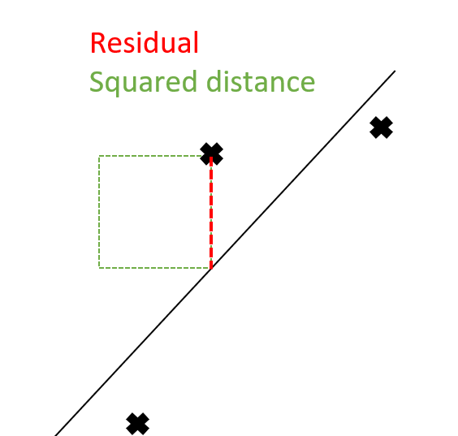

<!-- 
footer: Members: Achka Pieer, Rickayzen Philipp, Würf Jerome, Tauscher Johannes, Popov Tomislav
 -->
# Group 3: Regression
Content:
1. Introduction
2. Our Dataset
3. Comparison of Regression Models
    1. Least Squares
    2. Least Angle
    3. Partial Least Squares
    4. Ridge Regression
    5. Lasso

---
<!-- 
footer: ""
 -->

# 1. Introduction
- Our data set and model selection are based on the book ["The elements of statistical Learning"](https://hastie.su.domains/ElemStatLearn/)
- Our group focuses on linear regression problems
- A linear regression model is denoted function as $E(Y|X)$
    - $Y$ is the continuous output space on $R$
    - $X$ is the input space where an instance is a vector $\textbf{x}$ containing multiple measurements
- Benefits:
    - The trained models are interpretable
    - Reasonable performance on problems with sparse or low signal-to-noise data

--- 
# 2. Our Dataset
- [Prostate cancer](https://hastie.su.domains/ElemStatLearn/)
- 8 variables
- 67 observations

---
# 3. Comparison of Regression Models
---
# 3.i Least Squares
- $S(a) = \Sigma_{i=1}^N(y_i-a^Tx_i)^2$
    $=(y-Xa)^t(y-Xa)$
 - Optimal line be reducing S(a)
-  $a^*=arg\ \min_a{S(a)}\Rightarrow \nabla S(a)=0$ 
- Problems:
    - Heavily influcened by outlies
    - tends to overfit
---
# 3.ii Least Angle
---
# 3.iii Partial Least Squares
---
# 3.iv Ridge Regression
---
# 3.v Lasso
--- 
# 3.vi Locally Weighted Regression (LWR)
- Linear regression: $S(a)=(y-Xa)^T(y-Xa)$ 
- weighted regression: 
    - certain data points get more weight than others
    - $S(a)=(y-Xa)^TW(y-Xa)$
- Locally weighted regression:
    - Idea: local points weight points in proximity higher
    - in total E independent weighted regressions 
    - $S(a)=(y-Xa)^TW_E(y-Xa)$
    - e.g. $w_i = e^{\frac{-(x_i-x)^2}{2\tau^2}}$
---
# 3.vii Radial Basis Fucntion Regression (RBFR)
- Idea: transform data into a higher dimension and then perform linear regression 
- basis function: depends on distance to centre
- radial basis function: $\phi(x) = \phi(||x||)$
- linearly combine set of linear basis functions
- $S(a)=(y-\Phi(X)w)^T(y-\Phi(X)w)$
