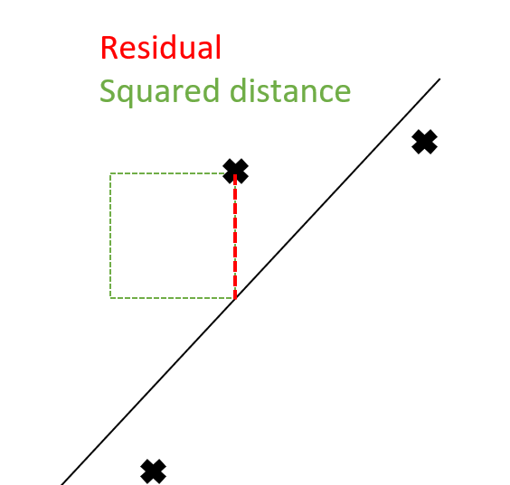

<!--
footer: Members: Achka Pieer, Rickayzen Philipp, Würf Jerome, Tauscher Johannes, Popov Tomislav

15 Minuten Zeitlimit + 5 Minuten fragen
 -->

---
# Group 3: Regression
Content:
1. Introduction
2. Our Dataset
3. Comparison of Regression Models
    1. Ordinary Least Squares
    2. Elastic Net (Ridge & Lasso Regression)
    3. Least Angle Regression
    4. PCA Regression
    5. Splines

---

# 1. Introduction

- Our group focuses on **linear regression** problems
- data and method selection based on [The Elements of Statistical Learning](https://hastie.su.domains/ElemStatLearn/)
- The goal of a regression is to inspcet a possible dependency of $Y$ given $X$
    - $Y \in  \mathbb{R}$ dependent variable
    - $X \in \mathbb{R}^p$ independent variable 
        - where an instance is a vector $x$ containing $p$ measurements
<!--- Benefits:
    - The trained models *(coefficients)* are interpretable
    - Reasonable performance on problems with sparse or low signal-to-noise data-->
---

# 1. Introduction
## Basic idea behind any regression
Optimize the following problem:
- $\underset{f}{argmin}\  \Sigma_{i=1}^n(y_i-f(x_i))^2$
<!--Quadratic function hence minimum always exists. 
 Function is called squared error loss and is a loss function-->
Example - Linear Regression
- $\underset{\beta}{argmin}\ =(y-X\beta)^t(y-X\beta)$

Ordinary Least Square Estimtor: 
- $\hat{\beta} = (X^t X)^{−1}X^t y$

---
# 2. Our Datasets

- UCI Data Repository
    - [real_estate](https://archive.ics.uci.edu/ml/datasets/Real+estate+valuation+data+set)
    - [winequality-red](https://archive-beta.ics.uci.edu/dataset/186/wine+quality)
    - [AirQualityUCI](https://archive-beta.ics.uci.edu/dataset/360/air+quality)
- Data proposed in Elements of Statistical Learning
    - [Prostate cancer](https://hastie.su.domains/ElemStatLearn/data.html)

---

# 3. Comparison of Regression Models
## Workflow
1. Implement regression methods using python libraries
2. Implement selected models from scratch
3. Evaluate and compare the implemented models
    - speed-performance
    - memory-performance
    - metric-performance (with default parameters)
---
# 3. Comparison of Regression Models
## i. Ordinary Least Squared

Ordinary Least Square Estimtor:  

$\hat{\beta} = (X^t X)^{−1}X^t y = (X^t X)^{−1}X^t (X\beta+\epsilon)$

- baseline with zero estimation bias
 $\mathbb{E}[\hat{\beta}] =\ .._{mathemagic}..\ = \beta + (X^t X)^{-1}X^t \mathbb{E}[\epsilon]$
 Since $\mathbb{E}[\epsilon]= 0$ by , it follows $\mathbb{E}[\hat{\beta}] = \beta$
- simple linear Algebra
- straight forward implementation
- more complex model trade it off for benefits of reduced variance

---
# 3.ii Principal Component Regression (PCR)
- Combines Principal Component Analysis (PCA) and Linear Regression
- Reduces complexity and dimensionality
- Process:
    - Standardize predictors
    - Perform PCA on predictors to obtain Principal Components (PCs)
    - Select a subset of PCs based on explained variance
    - Regress response on selected PCs, treating each as an univariate regression
- Key Equations:
    - PCA: $Z_m = Xv_m$
    - PCR: $\hat{y}^{pcr}_{(M)} = \bar{y}1 + \sum_{m=1}^{M} \hat{\theta}_m z_m$
    - Coefficients: $\hat{\beta}^{pcr}(M) = \sum_{m=1}^{M} \hat{\theta}_m v_m$
- Considerations:
    - Selected PCs might lack physical interpretability
    - Standardization of predictors is necessary
    - The choice of M (number of PCs) affects model complexity

---
# 3.iii Partial Least Squares (PLS) - OPEN TO EDIT
- Supervised learning method, related to PCA
- Key Steps:
    - Standardize predictors and responses
    - Compute PLS direction: $Z_1 = \Sigma c_{jk} X_k$
    - Obtain PLS loadings ($\gamma_{1j}$) and weights ($\delta_{1k}$) by regressing responses and predictors on $Z_1$
    - Deflate predictors and responses, repeat for more PLS directions
- Key Equations:
    - PLS Direction: $Z_1 = \Sigma c_{jk} X_k$
    - PLS Loadings: $\gamma_{1j}$
    - PLS Weights: $\delta_{1k}$

---
# 3.iv Elastic Net
- $\min_{w} { \frac{1}{2n_{\text{samples}}} ||X w - y||_2 ^ 2 + \alpha \rho ||w||_1 +
\frac{\alpha(1-\rho)}{2} ||w||_2 ^ 2}$
- based on Least Squares
- combines penalties of the Lasso and Ridge regression
- Lasso adds a penalty based on the $l_1$-norm of the trained coefficients
- Ridge adds a penalty based on the $l_2$-norm of the trained coefficients
- amount of penalty is controlled via the hyper-parameter $\alpha$
---
# 3.v Locally Weighted Regression (LWR)
- Linear regression: $S(a)=(y-Xa)^T(y-Xa)$
- weighted regression:
    - certain data points get more weight than others
    - $S(a)=(y-Xa)^TW(y-Xa)$
- Locally weighted regression:
    - Idea: local points weight points in proximity higher
    - in total E independent weighted regressions
    - $S(a)=(y-Xa)^TW_E(y-Xa)$
    - e.g. $w_i = e^{\frac{-(x_i-x)^2}{2\tau^2}}$
---
# 3.vi Radial Basis Function Regression (RBFR)
- Idea: transform data into a higher dimension and then perform linear regression
- basis function: depends on distance to centre
- radial basis function: $\phi(x) = \phi(||x||)$
- linearly combine set of linear basis functions
- $S(a)=(y-\Phi(X)w)^T(y-\Phi(X)w)$
---
# 4. Evaluation
- For each model and dataset we will compare our implementation with the ones from the libraries
- Model Scores:
    - Mean Squared Error
    $\text{MSE}(y, \hat{y}) = \frac{1}{n_\text{samples}} \sum_{i=0}^{n_\text{samples} - 1} (y_i - \hat{y}_i)^2$
    - Mean Absolute Error
    $\text{MAE}(y, \hat{y}) = \frac{1}{n_{\text{samples}}} \sum_{i=0}^{n_{\text{samples}}-1} \left| y_i - \hat{y}_i \right|$
- Performance benchmarks:
    - Runtime
    - Memory
---
# 5.  Remarks and Outlook
- Currently we use "default" settings for the regression (hyper-)parameters
- in the future more work could be put into tuning the methods for better results.
    - by excluding specific features
    - by engineering new features

---
# 6. Literature 
- [Notes on Regularized Least-Squares](http://cbcl.mit.edu/publications/ps/MIT-CSAIL-TR-2007-025.pdf)

- [Elements of Statistical Learning (Hastie et al.)](https://hastie.su.domains/Papers/ESLII.pdf)
