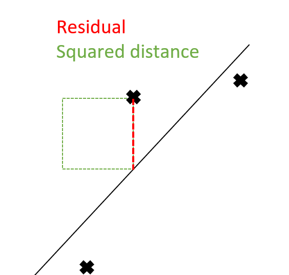
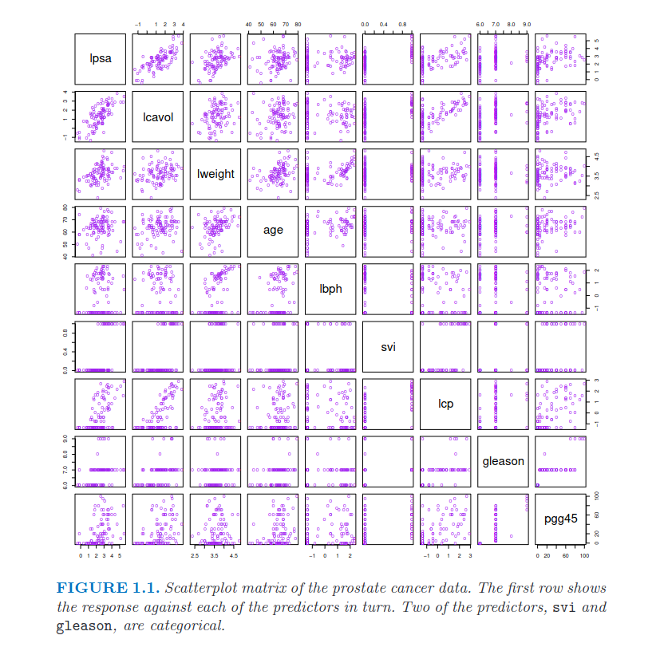
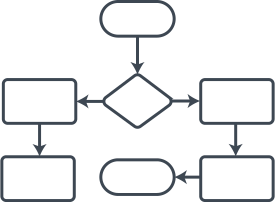

<!--

15 Minuten Zeitlimit + 5 Minuten fragen
 -->

# Group 3: Regression
1. Introduction
2. Our Datasets
3. Comparison of Regression Models
    1. Ordinary Least Squares
    2. Elastic Net (Ridge & Lasso Regression)
    3. Least Angle Regression
    4. PCA Regression
    5. Locally Weighted Regression
4. Evaluation
5. Remarks and Outlook
---

# 1. Introduction

- Our group focuses on **linear regression** problems
- Data and method selection based on [The Elements of Statistical Learning](https://hastie.su.domains/ElemStatLearn/)
- The goal of a regression is to inspect a possible dependency of $Y$ given $X$
    - $Y \in  \mathbb{R}$ dependent variable
    - $X \in \mathbb{R}^p$ independent variable
        - Where an instance is a vector $x$ containing $p$ measurements
<!--- Benefits:
    - The trained models *(coefficients)* are interpretable
    - Reasonable performance on problems with sparse or low signal-to-noise data-->
---

# 1. Introduction
## Basic idea behind any regression
Optimize the following problem:
- $\underset{f}{argmin}\ L(Y-f(X))$
<!--Quadratic function hence minimum always exists.
 Function is called squared error loss and is a loss function-->
Example - Linear Regression
- Minimize $\epsilon^t \epsilon = (y-X\beta)^t(y-X\beta)$
- $\underset{\beta}{argmin}\ (y-X\beta)^t(y-X\beta)$

Leads to the Ordinary Least Square Estimator:
- $\hat{\beta} = (X^t X)^{−1}X^t y$

---
# 2. Our Datasets

- UCI Data Repository
    - [real_estate](https://archive.ics.uci.edu/ml/datasets/Real+estate+valuation+data+set)
    - [winequality-red](https://archive-beta.ics.uci.edu/dataset/186/wine+quality)
    - [AirQualityUCI](https://archive-beta.ics.uci.edu/dataset/360/air+quality)
- Data proposed in Elements of Statistical Learning
    - [Prostate cancer](https://hastie.su.domains/ElemStatLearn/data.html)

---

# 3. Comparison of Regression Models
## Workflow
1. Implement regression methods using python libraries
2. Implement selected models from scratch
3. Evaluate and compare the implemented models
    - Metric-performance (with default parameters)
    - Speed-performance
    - Memory-performance
---
# 3. Comparison of Regression Models
## i. Ordinary Least Squared
Idea: find best-fitting line $f(x)=m + xb$ for $Y$ given $X$.

$\hat{\beta} = (X^t X)^{−1}X^t y = (X^t X)^{−1}X^t (X\beta+\epsilon)$

- Good baseline with zero estimation bias
 $\mathbb{E}[\hat{\beta}] = \mathbb{E}[(X^t X)^{−1}X^t (X\beta+\epsilon)]= \mathbb{E}[X^t (X\beta+\epsilon)] = \beta + (X^t X)^{-1}X^t \mathbb{E}[\epsilon]$
- in the last step we multiply from the left with $(X^t X)^{-1}X^t$ after distributing $X^t$.
 - since $\mathbb{E}[\epsilon]= 0$ since $\epsilon\sim N(0, \sigma^2)$ it follows $\mathbb{E}[\hat{\beta}] = \beta$
- More complex methods trade off for benefits of reduced variance

---
# 3. Comparison of Regression Models
## ii. Elastic Net (Lasso & Ridge)
Idea: tune down dimensions of $X$ that have little to no influence on $Y$.
<!--basically some kind of variable selection-->
Approach: Regularize Estimator $\hat{\beta}$ with respect to $|\ \hat{\beta}\ |$
- $\underset{\beta}{argmin}\ ||y-X\beta||^2 + \lambda_1||\beta||^2 + \lambda_2||\beta||_1$
- Elastic Net extends Ordinary Least Squares
- **Lasso** adds a penalty based on the $l_1$-norm of the coefficients
- **Ridge** adds a penalty based on the $l_2$-norm of the coefficients
- Choice of $\lambda_1$ and $\lambda_2$ are additional constraints for optimization problem

---
# 3. Comparison of Regression Models
## iii. Least Angle Regression
- **LAR** is a relative newcomer *(Efron et al., 2004)*
- “Democratic” version of forward stepwise regression
- Extremely efficient algorithm for computing the entire lasso path ($\lambda_1$  $\rightarrow \infty$ until convergence).
---
# 3. Comparison of Regression Models
## iv. Locally Weighted Regression (LWR)
Idea: Ordinary Least Squares but now certain data points get more weight than others
Approach: Construct weights (Matrix $W$)
- $\cal{L}$$_{weighted}(\beta)=(y-X\beta)^T \ W(y-X\beta)$

Locally weighted regression:
- Locally put emphasis on points in low proximity
- In total E independent weighted regressions
- $\cal{L}$$_{weighted}(\beta)=(y-X\beta)^T \ W_E(y-X\beta)$
- E.g. $w_i = e^{\frac{-(x_i-x)^2}{2\tau^2}}$
---
<!--
- Considerations:
    - Selected PCs might lack physical interpretability
    - Standardization of predictors is necessary
    - The choice of M (number of PCs) affects model complexity
-->
<!-- rausgekickt, oder??
---
# 3. Comparison of Regression Models
## iv. Partial Least Squares (PLS) - OPEN TO EDIT
- Supervised learning method, related to PCA
- Key Steps:
    - Standardize predictors and responses
    - Compute PLS direction: $Z_1 = \Sigma c_{jk} X_k$
    - Obtain PLS loadings ($\gamma_{1j}$) and weights ($\delta_{1k}$) by regressing responses and predictors on $Z_1$
    - Deflate predictors and responses, repeat for more PLS directions
- Key Equations:
    - PLS Direction: $Z_1 = \Sigma c_{jk} X_k$
    - PLS Loadings: $\gamma_{1j}$
    - PLS Weights: $\delta_{1k}$
-->
# 3. Comparison of Regression Models
## v. Principal Component Regression (PCR)
Idea: Combine PCA and Linear Regression
Approach: Reduce complexity and dimensionality
- Perform PCA to obtain Principal Components (PCs)
- Choose subset of PCs *(explained variance)*
- Regress response on selected PCs treating each as an univariate regression

Key Equations:
    - PCA : $Z_m = Xv_m$
    - PCR : $\hat{y}^{pcr}_{(M)} = \bar{y}1 + \sum_{m=1}^{M} \hat{\theta}_m z_m$
    - Coefficients : $\hat{\beta}^{pcr}(M) = \sum_{m=1}^{M} \hat{\theta}_m v_m$

---
<!-- rausgekickt.
# 3. Comparison of Regression Models
## vi. Radial Basis Function Regression (RBFR)
- Idea: transform data into a higher dimension and then perform linear regression
- basis function: depends on distance to centre
- radial basis function: $\phi(x) = \phi(||x||)$
- linearly combine set of linear basis functions
- $S(\phi_w)=(y-\Phi(X)w)^T(y-\Phi(X)w)$
---
-->
# 4. Evaluation
Comparison with standard libraries / procedures
- `scikit-learn`
    - [Ordinary Least Squares](https://scikit-learn.org/stable/modules/linear_model.html#ordinary-least-squares)
    - [Elastic Net](https://scikit-learn.org/stable/modules/linear_model.html#elastic-net)
    - [Lasso LARS](https://scikit-learn.org/stable/modules/linear_model.html#lars-lasso)
    - [PCA Regression](https://scikit-learn.org/stable/auto_examples/cross_decomposition/plot_pcr_vs_pls.html)
- Public libraries
    - [`localreg`](https://pypi.org/project/localreg/) (locally weighted regression)

---

# 4. Evaluation
For each method and dataset we compute ...
- Model Scores:
    - Mean Squared Error
    $\text{MSE}(y, \hat{y}) = \frac{1}{n} \sum_{i=0}^{n-1} (y_i - \hat{y}_i)^2$
    - Mean Absolute Error
    $\text{MAE}(y, \hat{y}) = \frac{1}{n} \sum_{i=0}^{n-1} \left| y_i - \hat{y}_i \right|$
- Performance benchmarks:
    - Runtime
    - Memory
---
# 5.  Remarks and Outlook
- Usage of "default" settings method hyper-parameters
- Future work: tuning methods for better results
    - By variable / feature selection
    - By engineering new features
    - Estimating hyper-parameters

---
# 6. Literature
- [Notes on Regularized Least-Squares](http://cbcl.mit.edu/publications/ps/MIT-CSAIL-TR-2007-025.pdf)

- [Elements of Statistical Learning (Hastie et al.)](https://hastie.su.domains/Papers/ESLII.pdf)

- [Many Regression Algorithms, One Unified Model (Stulp, Signaud)](http://www.freekstulp.net/publications/pdfs/stulp15many.pdf)

- [Scikit-Learn Documentation](https://scikit-learn.org/)
