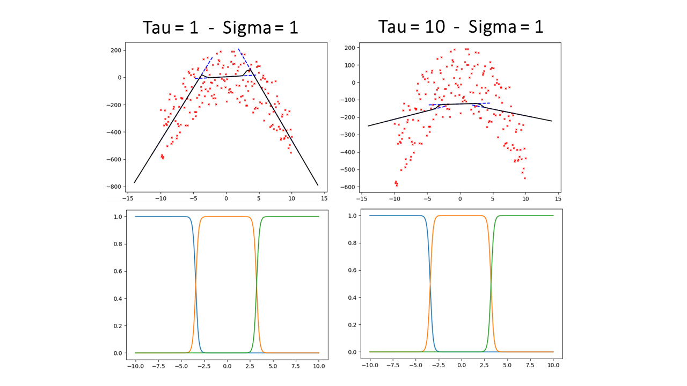
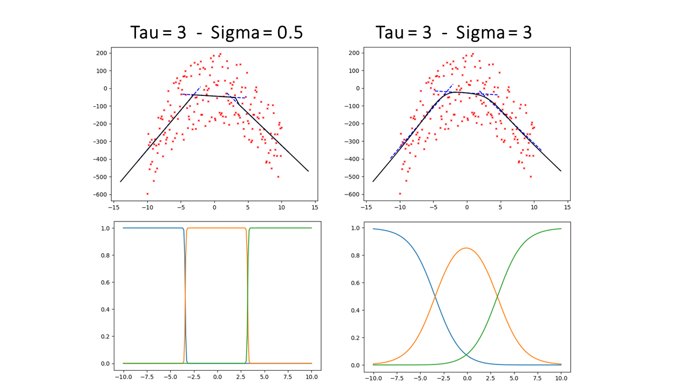

# Group 3: Regression
1. Introduction
2. Applied Software Engineering Principals
3. Regression Models
4. Applications
---
# Introduction
## A Brief Recap

- **Initial Plan:**
  - Focus: Linear Regression
  - Task: Implement five regression models
  - Validation: Compare with established implementations

- **Received Feedback:**
  - Focus on 1 or 2 models
  - Add educational value to the project
---
# Introduction
## Our New Approach
- Chose OLS and LWR as focus models
- Retained comparative study
- Developed two web applications
  - One for education
  - One for model visualisation
---
# 2. Applied software engineering principals
---
# 3. Regression Models 

  - Ordinary Linear Regression
  - Locally Weighted Regression

<!-- 
---
# 3. Regression Models - Oridinary Linear Regression

 $f(x) = \beta_0 + \Sigma_{i=1}^d x_i \cdot \beta_i$
 Optimising $L_\beta = \frac{1}{n}\Sigma_{j=1}^n(y-f(x_j))^2$
 $\Rightarrow \beta_{opt} = (X^t X)^{−1}X^t y$
-->
---
# 3. Regression Models - LWR

1. Divide intosections
2. For each section, calculate the weighted regression with weight $w_i(x) = e^{-\frac{(centre_i-x)^2}{2\tau^2}}$
3. Smoothen the function with $gauss_{centre}(x) = e^{-\frac{(centre-x)^2}{2\sigma^2}}$ and normalising it by dividing through $\Sigma_{centre} \ gauss_{centre}(x)$
 $f(x) = \frac{1}{\Sigma_i \ gauss_i(x)}\Sigma_{i} gauss_{i}(x)\cdot f_i(x)$ 

Hyperparameters: 
 - _amount sections_
 - _tau_
 - _sigma_ 

---
# 3. Regression Models - LWR - Influence of Tau

---
# 3. Regression Models - LWR - Influence of Sigma

---
# 4. Applications
---
