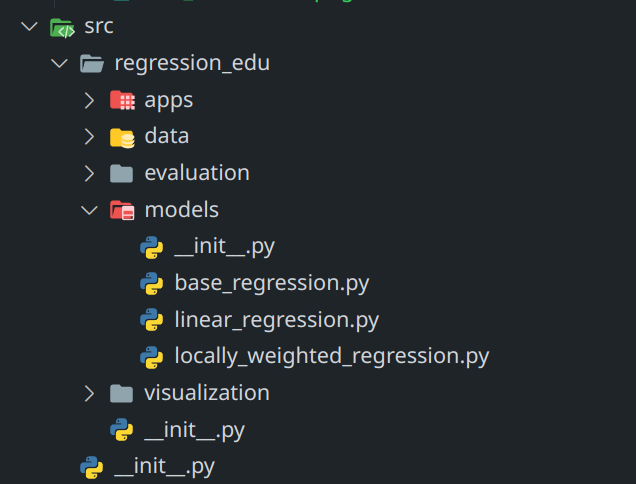
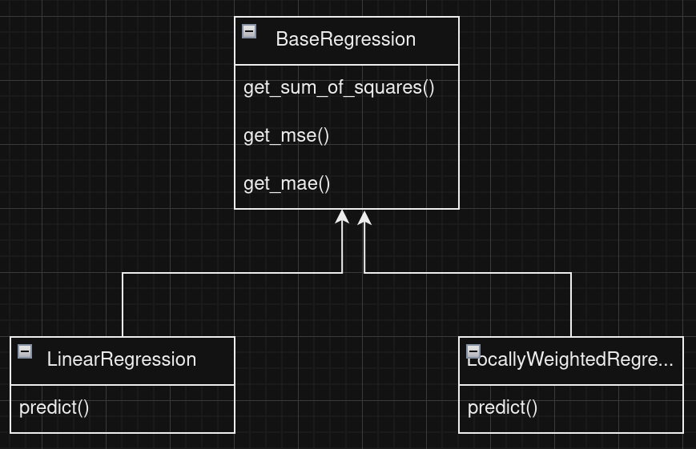
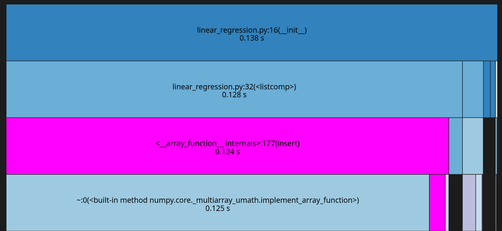
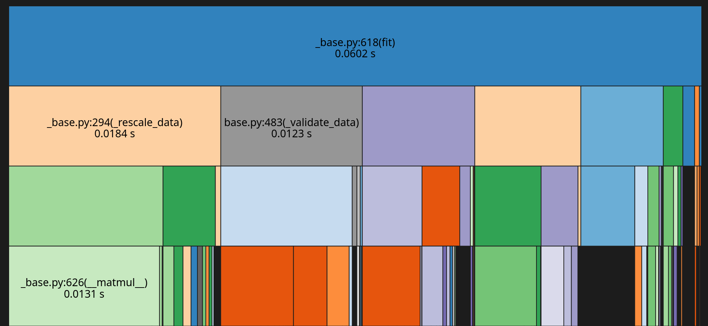
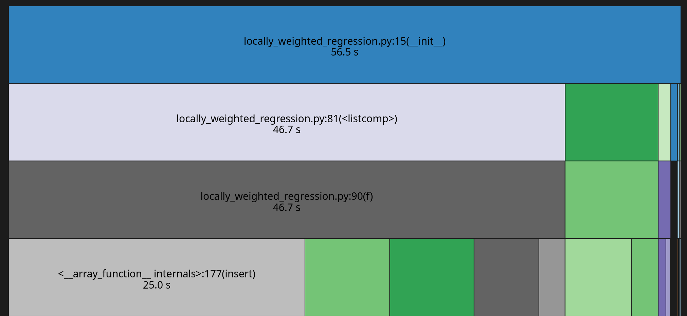
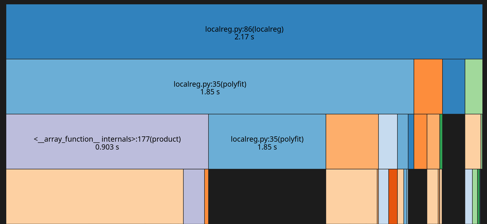

# Group 3: Regression
1. Introduction
2. Coding
3. Locally Weighted Regression in detail
4. Live Demo
---
# Introduction
## A Brief Recap

- **Initial Plan:**
  - Focus: Linear Regression
  - Task: Implement five regression models
  - Validation: Compare with established implementations

- **Received Feedback:**
  - Focus on 1 or 2 models
  - Add educational value to the project
---
# Introduction
## Our New Approach
- Chose OLS and LWR as focus models
- Retained comparative study
- Developed two web applications
  - One for education
  - One for model visualization

--- 
# 2. Coding
 - Dev setup
 - SWE principals

---
## 2.1 Coding - Dev setup

- Fixed python version via pyenv (python 3.11)
- Dependencies loaded via pip into a virtual env of the `venv` module of the standard lib
- Code formatting with `black`
- Linting with `pylint`
- Reviews of pushed code
- Usage of github issue tracker

--- 
## 2.2 SWE principals -- Separation of concerns

---

## 2.3 SWE principals -- Inheritance

---

# 3. Locally Weighted Regression (LWR) in Detail

<!-- 
---
# 3. Regression Models - Oridinary Linear Regression

 $f(x) = \beta_0 + \Sigma_{i=1}^d x_i \cdot \beta_i$
 Optimising $L_\beta = \frac{1}{n}\Sigma_{j=1}^n(y-f(x_j))^2$
 $\Rightarrow \beta_{opt} = (X^t X)^{−1}X^t y$
-->
---
# 3.1 LWR in Detail

1. Divide intosections
2. For each section, calculate the weighted regression with weight $w_i(x) = e^{-\frac{(centre_i-x)^2}{2\tau^2}}$
3. Smoothen the function with $gauss_{centre}(x) = e^{-\frac{(centre-x)^2}{2\sigma^2}}$ and normalising it by dividing through $\Sigma_{centre} \ gauss_{centre}(x)$
 $f(x) = \frac{1}{\Sigma_i \ gauss_i(x)}\Sigma_{i} gauss_{i}(x)\cdot f_i(x)$ 

Hyperparameters: 
 - _amount sections_
 - _tau_
 - _sigma_ 

---
# 3. LWR in Detail - Influence of Tau

---
# 3. LWR in Detail - Influence of Sigma

---
# 4. Runtime Performance

---

### 4.1 Linear Regression (ours)

---
### 4.2 Linear Regression (from sklearns)

---
### 4.3 Linear Regression (ours)

---
### 4.4 Linear Regression (from localreg)

---
# 4. Live Demo
---
